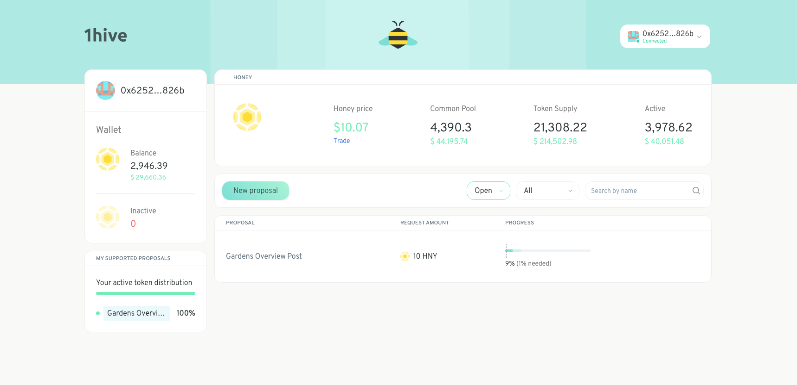

Honey is similar to Bitcoin or Ether because it is a digital currency issued and distributed by an economic protocol. Unlike Bitcoin or Ether, the protocol that issues and distributes Honey does not narrowly define the activities (eg mining) which are valuable, instead it relies on a continuous process where holders can influence priorities by staking on distribution proposals and thereby collectively invest resources towards the activities that the community determines to be most worthwhile at any given time.

As a currency the main function of Honey is as a medium of exchange, store of value, and unit of account. Admittedly, it's almost certainly not the best choice for any of those things in a global context due to the relatively small size of the 1Hive community and shallow exchange liquidity, but we believe that the local nature of [community currencies](https://en.wikipedia.org/wiki/Community_currency) will become a useful and prolific tool for online communities like ours to coordinate and align around shared values, especially as the emergence of blockchains and automated market makers make the ease of exchange between even relatively illiquid assets seamless.

While the total market for non-state commodity money as a whole may be massive (potentially as large as [100 Trillion](https://multicoin.capital/2018/10/09/100-trillion/)), it’s our belief that the ability to rapidly exchange digital assets will result in a multitude of more local, community-oriented digital currencies to co-exist—splitting the market rather than concentrating in a single winner-take-all scenario where one currency becomes globally dominant.

Community currencies like Honey will compete and differentiate themselves based on community values and their constituents collective ability to invest in infrastructure, development, and public goods that support the growth of their internal economies. Holding a specific community currency will signal value alignment and social proof, becoming a marker of status and identity in a global socioeconomic network.

## Honey Distribution Proposals

The issuance and distribution model for Honey is simple, each block new Honey is issued and accumulates into a common pool, from there it is distributed using a proposal and staking process conceptually pioneered by [Block Science](https://block.science/) and [Commons Stack](https://commonsstack.org/) called [conviction voting](https://medium.com/giveth/conviction-voting-a-novel-continuous-decision-making-alternative-to-governance-aa746cfb9475).

Anyone can submit a proposal requesting a portion of the common pool be allocated to a specific beneficiary. Honey holders can stake on the proposals to signal their support. You can access the Honey issuance and distribution dashboard at [1hive.org](https://1hive.org/#).

We can measure the conviction (support over time) of a proposal as a proportional measure between 0 and 100 percent. Each proposal requires a different conviction threshold in order to be approved, and this threshold depends on how much of the common pool balance the proposal is requesting. So if a request is small, it will require less conviction to be approved, and as the proportion of the common pool requested increases the threshold required approaches infinity.

As a result the mechanism is able to allocate resources without requiring complete consensus between stakeholders and even minority stakeholders can have significant influence on where shared resources are allocated.

## Buy, Hold, Sell?

The value of Honey will ultimately be determined by supply and demand. Supply will increase gradually through ongoing issuance, but demand depends on the community collectively finding and investing in use cases that increase the utility of Honey and grows the aggregate value within the Honey economy.

When you choose to buy or hold Honey you are supporting and betting on the growth of the 1Hive economy. As a holder you can influence the direction of the community by staking on proposals and directing the flow of issuance towards what you believe to be the most worthwhile initiatives.

If you choose to sell Honey, no big deal every market needs both buyers and sellers and when you sell you are transferring Honey to someone who values it more than you do.

You can buy, sell, or contribute liquidity for Honey on the [uniswap v1 instance we have deployed to xDai](https://uniswap.1hive.org/#/).

## Why xDai

We are excited to launch and begin allocating Honey through proposal staking and to begin to establish and grow a Honey-centric economy. Being able to validate, experiment, and establish social norms during these early stages of the community is critical. **We want to do that as quickly and with as little friction as possible, so we have decided to launch Honey on xDAI where there is very little network congestion and transaction fees are not a significant concern.** This will allow us to focus on what matters most—building and circulating value within the Honey economy, while at the same time avoiding the friction caused by a wildly volatile transaction fee market and uncertain timeline for practical scalability on Ethereum today.

We may outgrow the xDai network or find other solutions that are a better fit in the future, that's fine and to be expected. Eventually the community could migrate to an [Ethermint chain](https://github.com/cosmos/ethermint), or perhaps take advantage of emerging layer 2 solutions like [optimistic rollups](https://optimism.io/) as they mature. In the meantime though, xDai offers everything we need to test our basic assumptions, iterate, improve, and grow as a community. When the time comes the community can coordinate to fork Honey again (as we did previously from Rinkeby to Ethereum, and more recently from Ethereum to xDai) as we improve our assumptions and the underlying issuance and distribution protocol.
