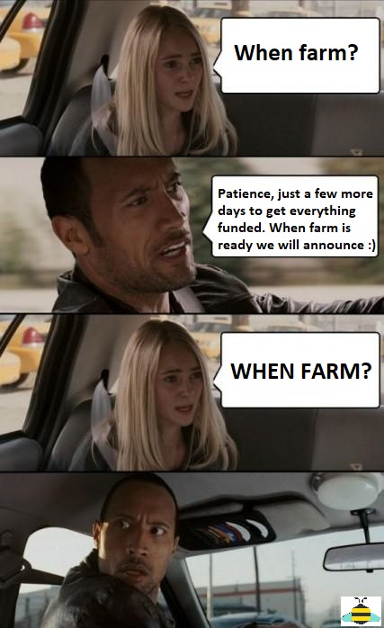

Two weeks have passed and the community has had some time to consolidate. There are a lot of new faces and new contributors from different regions. After having to stop Conviction Voting due to a misconfiguration these last two weeks were a blessing in disguise that gave us breathing space after the explosion of growth we had.

The process to submit new proposals was updated and a new social expectation started to grow towards better moderation. The documentation grew significantly with community members jumping to create onboarding guides, FAQ, video tutorials and translations. The Discord server was reorganized with different roles for each swarm to improve our daily communications.

The pollen distribution using SourceCred is a success, new community members are excited about being rewarded for their contributions. We have a [forum post](https://forum.1hive.org/t/new-pollen-proposal-for-period-starting-oct-23/407/) with a proposal to keep funding the initiative in future weeks that saw a lot of engagement and discussion.

## When farming?

  
  
    Cred to Detzy for 
    <a href="https://discord.com/channels/698287700834517064/743890898781339658/764545821651763232">
      this amazing meme
    </a>
  

The conviction voting smart contract issue was fixed and we have everything ready to launch the HNY farming program!

We have created a forum post (link) and 3 proposals to fund the 3 main pools to kickstart the farming which are the following:

- “Dai Daisies” 🌼 pool that holds the `HNY-WXDAI` pair with 300 HNY
- “STAKE Sunflower” 🌻 pool that holds the `HNY-STAKE` pair with 200 HNY
- “Ether Eucalyptus” 🌿 pool that holds the `WETH-HNY` pair with 100 HNY

Liquidity incentives have proved to be an excellent tool to attract more participants to a network and grow the liquidity of assets involved. For the 1hive community and the Honey token the incentives play a key role to keep experimenting with circular economies. Honeyswap success is coupled to the Honey economy as a portion of every swap fee flows back to the common pool to fund further community proposals.

Anyone can champion a proposal to fund a new pool on [hny.farm](https://hny.farm/). We encourage everyone to create a forum post and start a discussion there about why you think it may be a good fit.

Let the farming games begin!

## Honeypot v2

Version 2 of the Honeypot is coming along next week with a fresh install of the conviction voting app, this is a huge user experience enhancement that includes users profiles and a renovated proposal feed!

  

It will also involve a new installation of the smart contract so all the existing proposals at that point will be void. We encourage the members of the community to take this week to write and start discussing the proposals on the [forum](https://forum.1hive.org) using the [new template](https://forum.1hive.org/new-topic?category=Proposals) so we can have high quality proposals on the new version of honey pot.
